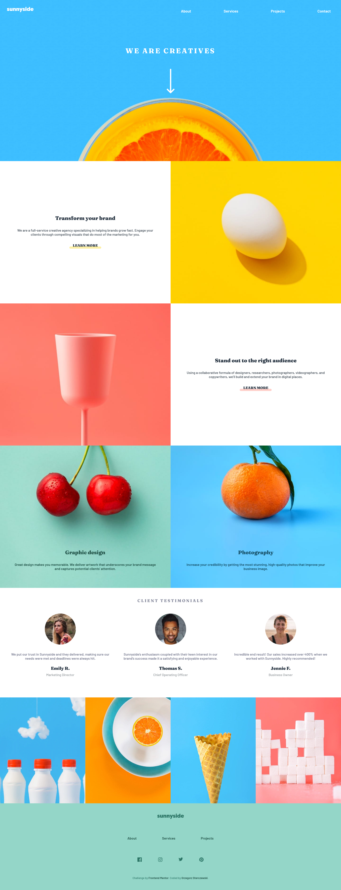

# Frontend Mentor - Sunnyside agency landing page solution

This is a solution to the [Sunnyside agency landing page challenge on Frontend Mentor](https://www.frontendmentor.io/challenges/sunnyside-agency-landing-page-7yVs3B6ef). Frontend Mentor challenges help you improve your coding skills by building realistic projects.

## Table of contents

- [Overview](#overview)
  - [The challenge](#the-challenge)
  - [Screenshot](#screenshot)
  - [Links](#links)
- [My process](#my-process)
  - [Built with](#built-with)
  - [Useful resources](#useful-resources)
- [Author](#author)

## Overview

### The challenge

Users should be able to:

- View the optimal layout for the site depending on their device's screen size
- See hover states for all interactive elements on the page

### Screenshot

### Links

- Solution URL: [Add solution URL here](https://your-solution-url.com)
- Live Site URL: [You can check it here](https://fm-sunnyside.vercel.app/)

## My process

### Built with

- Semantic HTML5 markup
- Pure CSS
- Flexbox
- Mobile-first workflow
- [Vite](https://vitejs.dev/) - Super fast JS tooling

### Useful resources

- [removeEventListner problem when binding 'this'](https://stackoverflow.com/questions/33859113/javascript-removeeventlistener-not-working-inside-a-class) - This helped me to discover, why I can't remove event listener from element.

- [Shift key press detection](https://developer.mozilla.org/en-US/docs/Web/API/KeyboardEvent/shiftKey) - How to detect if shift key is pressed

## Author

- Frontend Mentor - [@GSterczewski](https://www.frontendmentor.io/profile/GSterczewski)
- Twitter - [@gregs_dev](https://twitter.com/gregs_dev)
